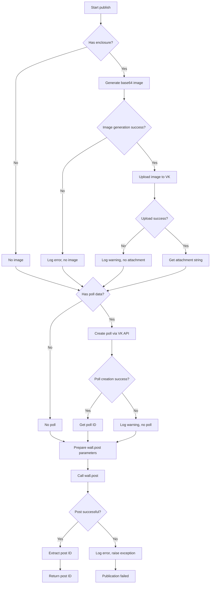

# VK Publisher Implementation Plan

## Objective
Implement the actual VK publishing logic in `VKPublisher.publish()` method with comprehensive comments and logging.

## Current State
- `VKPublisher` class already exists in `src/services/publisher/vk_publisher/vk_publisher.py`
- `publish` method is a stub with a TODO comment
- Image generation logic (`_get_base64_image`) is already implemented
- VK API client (`self._vk`) is initialized in `__init__`
- Configuration includes `access_token` and `publishing_id` (group ID)

## Requirements
1. Upload image (if present) to VK and get attachment string
2. Create poll (if poll data present) and get poll ID
3. Post to VK group wall with text, image attachment, and poll
4. Return post ID as string (as per interface contract)
5. Add detailed comments (in Russian) and logging at each step
6. Handle errors gracefully with appropriate logging

## Implementation Steps

### 1. Add Helper Methods
Create private helper methods to keep `publish` clean:
- `_upload_image(base64_image: str) -> str | None`: Uploads base64 image to VK, returns attachment string or None on failure.
- `_create_poll(poll_title: str, poll_options: list[str]) -> str | None`: Creates poll via VK API, returns poll ID or None on failure.

### 2. Modify `publish` Method
Replace the current stub with the following flow:

```python
async def publish(self, text: ReadyText) -> str:
    """
    Публикует статью с заданным заголовком, содержанием и изображением.
    Возвращает идентификатор опубликованного поста.

    Алгоритм:
    1. Генерация изображения (если есть enclosure)
    2. Загрузка изображения в VK (если изображение сгенерировано)
    3. Создание опроса (если указаны poll_title и poll_options)
    4. Публикация поста на стене группы с текстом, вложениями и опросом
    5. Возврат ID поста

    В случае ошибок на отдельных этапах (загрузка изображения, создание опроса)
    публикация продолжается без соответствующего элемента с записью в лог.
    """
    # Step 1: Generate image
    # Step 2: Upload image if present
    # Step 3: Create poll if data present
    # Step 4: Prepare wall.post parameters
    # Step 5: Execute wall.post
    # Step 6: Extract and return post ID
```

### 3. Detailed Step-by-Step Implementation

#### Step 1: Image Generation (Already Implemented)
- Use existing `_get_base64_image` method
- Wrap in try-except with logging

#### Step 2: Image Upload
- If image is not None, call `_upload_image`
- `_upload_image` should:
  - Decode base64 to bytes
  - Call `photos.getWallUploadServer` to get upload URL
  - Upload image via HTTP POST (use `requests` or `httpx`)
  - Call `photos.saveWallPhoto` with server response
  - Construct attachment string: `photo{owner_id}_{photo_id}`
  - Log each step (info for success, warning for failures)
  - Return attachment string or None if any step fails

#### Step 3: Poll Creation
- If `text.poll_title` and `text.poll_options` are present, call `_create_poll`
- `_create_poll` should:
  - Call `polls.create` with appropriate parameters
  - Extract poll ID from response
  - Return poll ID as string
  - Log creation attempt and result
  - Return None on failure

#### Step 4: Prepare Wall Post Parameters
- Build `attachments` string: comma-separated list of attachments (image attachment if present)
- Build `owner_id`: negative group ID from `self._config.publishing_id`
- Build `message`: `text.text` (full post text)
- If poll ID present, add `poll_id` parameter

#### Step 5: Execute Wall Post
- Call `self._vk.wall.post` with prepared parameters
- Handle VK API errors (catch `vk_api.exceptions.ApiError`)
- Log success with post ID
- On error, log error and raise appropriate exception

#### Step 6: Return Post ID
- Extract `post_id` from API response
- Return as string

### 4. Logging Strategy
- Use `logger.info` for major steps (starting publication, image upload success, poll creation success, post published)
- Use `logger.warning` for non-critical failures (image upload failed, poll creation failed)
- Use `logger.error` for critical failures (VK API initialization error, wall.post failure)
- Include relevant identifiers (post GUID, group ID) in log messages
- Follow existing logging format: `%(asctime)s [%(levelname)s] %(name)s: %(message)s`

### 5. Error Handling
- Use try-except blocks around each VK API call
- Convert VK API exceptions to more descriptive errors
- Ensure that failures in non-essential components (image, poll) don't block publication
- Raise `PublisherError` (to be defined) if wall.post fails

### 6. Testing Considerations
- The class already has `testing_mode` flag
- In testing mode, we might want to mock VK API calls
- Consider adding unit tests for new helper methods

## Code Changes Summary

### Files to Modify
1. `src/services/publisher/vk_publisher/vk_publisher.py`
   - Implement `_upload_image` method
   - Implement `_create_poll` method
   - Update `publish` method with full logic
   - Add necessary imports (`base64`, `httpx`, `vk_api.exceptions`)

### Potential New Dependencies
- `httpx` for image upload (already in dependencies via `httpx>=0.28.1`)
- No additional packages needed

## Mermaid Flow Diagram



## Next Steps
1. Review this plan with the user
2. Switch to Code mode for implementation
3. Implement helper methods
4. Update publish method
5. Test with real VK API (using test credentials)
6. Verify logging output

## Risks and Mitigations
- VK API rate limits: Implement retry logic with exponential backoff
- Image size limits: Validate image dimensions before upload
- Network failures: Use timeout and retry for HTTP requests
- Authentication errors: Ensure token is valid and has necessary permissions
